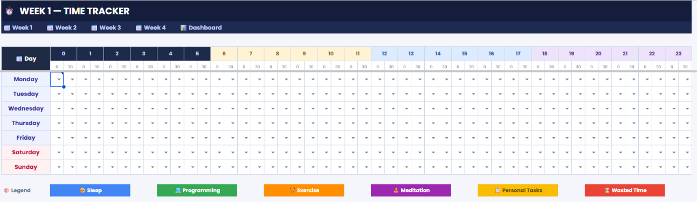
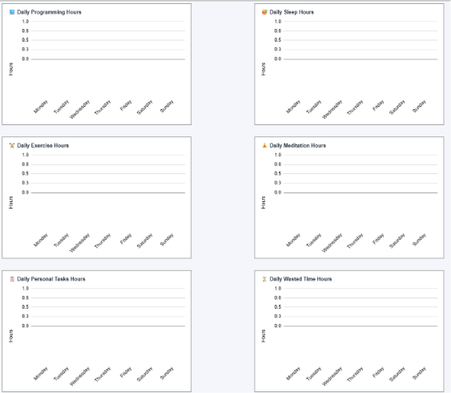
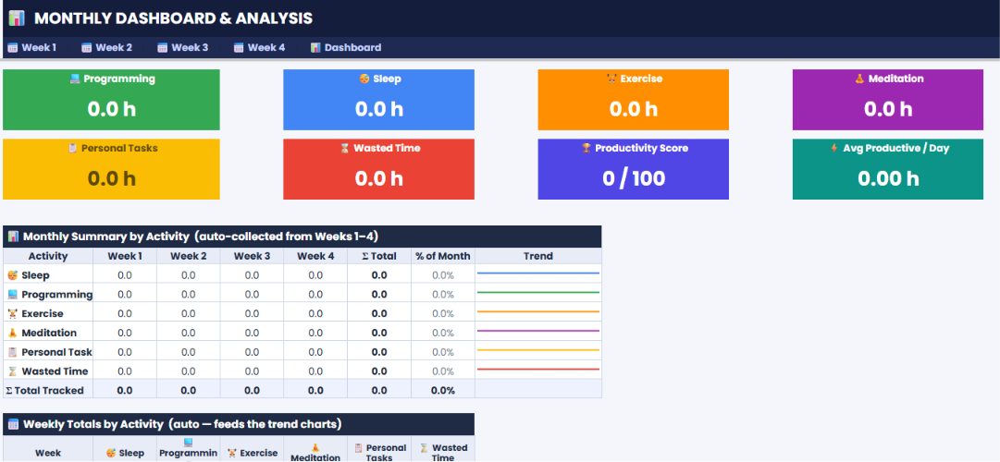

<div align="center">

# ⏱️ Premium Google Sheets Time Tracker

### 🚀 A Fully Automated Productivity Dashboard Built with Google Apps Script

Transform Google Sheets into a beautiful, intelligent, and fully automated productivity system.


</div>

---

# 📖 About

**Premium Google Sheets Time Tracker** is a fully automated productivity dashboard that transforms a regular Google Spreadsheet into a professional time management application.

Instead of manually tracking your time, calculating statistics, and creating reports, everything is generated and updated automatically using **Google Apps Script**.

Designed with a modern UI, dynamic charts, colorful dashboards, KPI cards, and intelligent automation, this project provides a complete weekly and monthly productivity analysis system inside Google Sheets.

---

# ✨ Features

## 🎯 Time Tracking

- 336 Half-Hour Time Blocks per Week
- Dropdown Activity Selection
- Automatic Color Coding
- 6 Activity Categories
- Weekly Scheduling
- Visual Timeline

---

## 📅 Weekly Dashboard

Every week includes:

- Time Tracker
- Daily To-Do Lists
- Statistics
- Analytics
- Charts
- Reflection Journal

---

## 📊 Monthly Dashboard

Automatically combines all four weeks.

Includes:

- KPI Cards
- Monthly Reports
- Activity Trends
- Productivity Score
- Weekly Comparisons
- Monthly Analytics

---

# 🎨 Activity Categories

| Activity | Color |
|----------|-------|
| 😴 Sleep | 🔵 Blue |
| 💻 Programming | 🟢 Green |
| 🏃 Exercise | 🟠 Orange |
| 🧘 Meditation | 🟣 Purple |
| 👤 Personal Tasks | 🟡 Yellow |
| ⛔ Wasted Time | 🔴 Red |

Every activity automatically updates charts, summaries and reports.

---

# 📈 Automatic Analytics

The spreadsheet calculates:

- Total Hours
- Daily Hours
- Weekly Hours
- Monthly Hours
- Activity Percentages
- Productivity Score
- Average Productive Time
- Average Sleep
- Weekly Comparison
- Monthly Summary

No manual calculations required.

---

# 📊 Charts Included

## Weekly

- Programming
- Sleep
- Exercise
- Meditation
- Personal Tasks
- Wasted Time
- Weekly Distribution
- Productivity Trend

## Monthly

- Weekly Comparison
- Monthly Distribution
- Programming Progress
- Sleep Trend
- Exercise Trend
- Meditation Trend
- Wasted Time Trend
- Productivity Gauge

All charts update automatically.

---

# 📝 Reflection Sections

Each week includes:

- Wins
- Challenges
- Lessons Learned
- Improvements
- Notes

Monthly Dashboard includes:

- Biggest Achievement
- Biggest Mistake
- Better Habits
- Bad Habits
- Goals
- Notes

---

# 🧠 Productivity Score

The dashboard automatically evaluates your month based on:

✅ Programming

✅ Exercise

✅ Meditation

✅ Personal Tasks

✅ Healthy Sleep

❌ Wasted Time

The result is displayed using KPI Cards and visual charts.

---

# ⚙️ Automation

Powered entirely by **Google Apps Script**.

Automatically creates:

- Sheets
- Tables
- Dropdowns
- Conditional Formatting
- Charts
- Formulas
- Named Ranges
- KPI Cards
- Reports

Everything updates instantly after changing a single time block.

---

# 📂 Spreadsheet Structure

```
Google Spreadsheet
│
├── Week 1
├── Week 2
├── Week 3
├── Week 4
└── Monthly Dashboard
```

---

# 🚀 Installation

## Step 1

Create a new Google Spreadsheet.

---

## Step 2

Open

```
Extensions → Apps Script
```

---

## Step 3

Delete the default code inside **Code.gs**

---

## Step 4

Copy the **Code.gs** file from this repository.

Paste it into the Apps Script editor.

---

## Step 5

Save the project.

```
Ctrl + S
```

---

## Step 6

Select the function

```
buildTimeTracker
```

Press

```
▶ Run
```

---

## Step 7

Authorize Google Apps Script.

The script only modifies the current spreadsheet.

---

## Step 8

Wait approximately

```
60–90 seconds
```

Everything will be generated automatically.

---

# 📸 Screenshots

## Weekly Dashboard

> Add Screenshot



---

## Weekly Charts

> Add Screenshot



---

## Monthly Dashboard

> Add Screenshot



---


# 🗂 Folder Structure

```
premium-google-sheets-time-tracker/
│
├── Code.gs
├── README.md
├── LICENSE
└── screenshots/
```

---

# 🛣 Roadmap

- [x] Weekly Time Tracker
- [x] Monthly Dashboard
- [x] KPI Cards
- [x] Dynamic Charts
- [x] Automatic Reports
- [x] Reflection Journal
- [ ] Dark Mode
- [ ] Multiple Themes
- [ ] Annual Dashboard
- [ ] Habit Tracking
- [ ] Goal Tracking
- [ ] Calendar View
- [ ] Mobile Layout

---

# 🤝 Contributing

Pull requests are welcome.

If you'd like to improve the project, feel free to fork the repository and submit a PR.

---

# ⭐ Support

If this project helped you, please consider giving it a ⭐ on GitHub.

It really helps the project grow.

---

# 📄 License

This project is licensed under the MIT License.